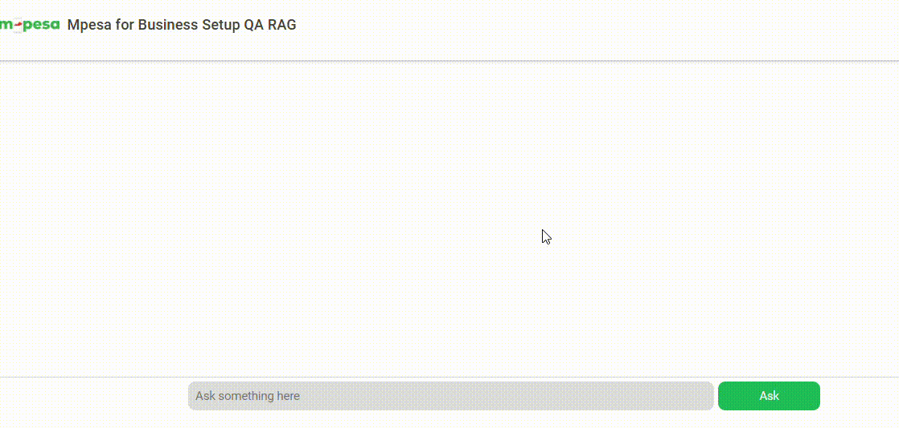

## Mpesa Simple QA Retrieval-Augmented Generation Chat
In this tutorial we are going to build a Quetion-Answering RAG Chat Web App. We utilize Node.js and HTML, CSS, JS. We also incorporate Langchain.js + Azure OpenAI + MongoDB Vector Store (MongoDB Search Index). Get a quick look below.


 
## Getting Started
1. You will need to make sure you have the following:

    * Node LTS 18 +
    * Git
    * A github account
    * Basic JavaScript and Node.js skills
    * Azure Subscription - register for Azure here to get $100 free credit if you are a student: https://azure.microsoft.com/free/students?wt.mc_id=studentamb_223887 otherwise register for a free trial period of about 3 months on Azure

2. Get the repository fork, then git clone your own fork afterwards follow the next instructions in for setting up Node.js application:
    After forking the url to your fork
    ```
    git clone https//... .git
    ```
    
    ```
    cd azure-qa-rag-mpesa
    ```

## Setting Up the Node.js Application
1. Open a terminal and check if you have the latest version of Node.js LTS installed (it should be Node 18 LTS and above), as of the time this documentation was written.

    ```
    node --v
    ```

2. Check if you are in the current project folder e.g.  ...\azure-qa-rag-mpesa> in the terminal and install the necessary libraries needed.

    ```
    npm install
    ```

3. Create your .env file in root/ project folder and paste in this in the .env file
    ```
    AZURE_OPENAI_API_INSTANCE_NAME=
    AZURE_OPENAI_API_DEPLOYMENT_NAME=
    AZURE_OPENAI_API_DEPLOYMENT_EMBEDDING_NAME=
    AZURE_OPENAI_API_KEY=
    AZURE_OPENAI_ENDPOINT=https://eastus2.api.cognitive.microsoft.com
    AZURE_OPENAI_API_VERSION=2023-05-15
    LANGCHAIN_TRACING_V2=false
    LANGCHAIN_API_KEY=
    PORT=5000
    BASE_URL=/app/custom-rag/v1.0
    MONGODB_ATLAS_URI=
    MONGODB_ATLAS_COLLECTION_NAME=
    MONGODB_ATLAS_DB_NAME=
    ```
## Azure Resources Set Up with Azure CLI
You can download Azure CLI here: 

<b>1. Login into Azure</b>
```
az login
```

<b>2. Create Resource Group</b>
```
az group create --name OpenAIExample --location eastus2
```

<b>3. Create new Azure OpenAI Resource</b>

To check all the Subscription tiers available e.g. s0 or F0
Make sure you choose s0 to get free resources, though not recommended for production.
```
az cognitiveservices account list-skus --kind OpenAI --location eastus2
```

```
az cognitiveservices account create --name exampleOpenaiInstance --resource-group OpenAIExample --location eastus2 --kind OpenAI --sku s0 --subscription <replace with id from step 1>
```

<b>4. Get Deployed Resource Information</b>
* Get Endpoint URL
```
az cognitiveservices account show --name exampleOpenaiInstance --resource-group openAIExample
```
Go ahead and look for endpoint it should look like this: https://eastus2.api.cognitive.microsoft.com/
* Get API Key
```
az cognitiveservices account keys list --name exampleOpenaiInstance --resource-group openAIExample
```
Copy Key 1 into the appropriate .env variables, it should look like this - 10abf31a63c54b4f84027xxxxx625ace

<b>5. It's now time to deploy a Model to Azure</b>

In this example we are going to use an embedding called <b>text-embedding-ada-002</b>. Here are the steps.

Chat completions model deployment:

```
az cognitiveservices account deployment create --name exampleOpenaiInstance --resource-group OpenAIExample --deployment-name myChatsCompletion --model-name gpt-35-turbo --model-version "0125" --model-format OpenAI --sku-capacity "1" --sku-name "Standard"
```

Text Embedding model deployment:

```
az cognitiveservices account deployment create --name exampleOpenaiInstance --resource-group openAIExample --deployment-name myEmbeddingModel --model-name text-embedding-ada-002 --model-version "2" --model-format OpenAI --sku-capacity "1" --sku-name "Standard"
```

<b>6. Create a MongoDB Cluster Vector Store</b>
Follow these instructions:

* https://js.langchain.com/docs/integrations/vectorstores/mongodb_atlas/

Kindly follow the steps highlighted here if you want to use Azure CosmosDB instead: https://learn.microsoft.com/azure/cosmos-db/mongodb/vcore/quickstart-portal?wt.mc_id=studentamb_223887 

## Deploy to Azure App Services

Follow the steps here: https://learn.microsoft.com/azure/app-service/quickstart-nodejs?wt.mc_id=studentamb_223887 

OR

```
az webapp up --sku F1 --name mpesaqarag --location eastus2 --resource-group openAIExample --debug --runtime "Node - 18-lts"
```

The az webapp up command does the following actions:

* Create a default resource group.

* Create a default App Service plan.

* Create an app with the specified name.

* Zip deploy all files from the current working directory, with build automation enabled.

* Cache the parameters locally in the .azure/config file so that you don't need to specify them again when deploying later with az webapp up or other az webapp commands from the project folder. The cached values are used automatically by default.

## Cleaning Up
Delete the models

```
az cognitiveservices account deployment delete --name exampleOpenaiInstance --resource-group  openAIExample --deployment-name EmbedsOpenAI
```

Purge the resource
```
az cognitiveservices account purge --location eastus2 --resource-group OpenAIExample --name exampleOpenaiInstance

```

Delete the entire resource group, remember this helps you save credits. If you are not planning to go into production.

```
az group delete --name openAIExample
```
